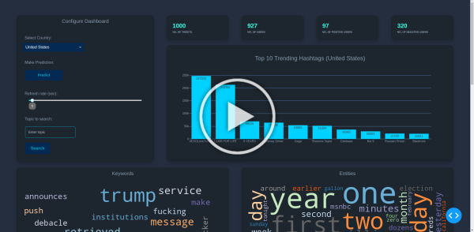
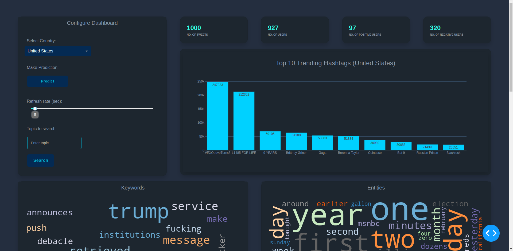
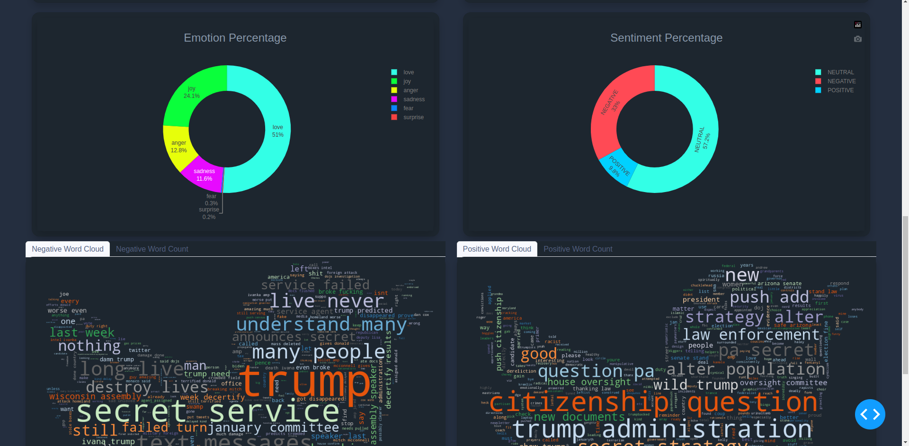
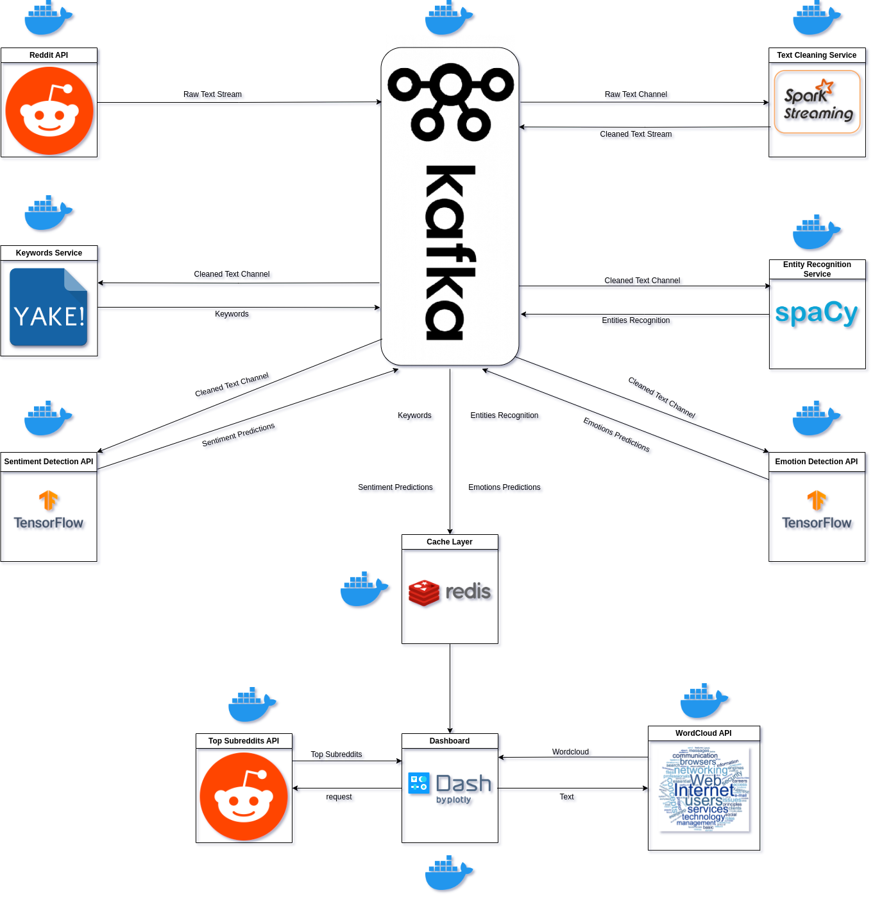

# Streaming Event Driven Microservice Architecture

## Demo:
 

<!--  -->

<!-- <video src="assets/demo.mp4" controls="controls" style="max-width: 730px;">
</video> -->

## What is it?
It is a real-time subreddit text analysis dashboard.

## Idea
To be able to keep up with trending hashtags and topics, a dashboard is used to get keywords, entities, subreddit' sentiment, subreddit' emotions, and frequent words from a given hashtag/topic.
## Architecture

Implemented Lambda Architecture to handle the streaming of twitter's data ingested by Kafka, then to Spark to be processed, then stored in Cassandra as the batch storage, and to Redis as the speed layer to be analyzed in Dash. Each component is its own microservice. 
 
 

**Microservices:**

- SparkStream is a python package (<a href="https://pypi.org/project/SparkStream/#description">SparkStream-pypi</a>). A simple spark streaming handler; it listens to a kafka topic, process the data, and store it into cassandra and redis. Accessible via an API and deployed in a docker container. <a href="https://github.com/HassanRady/Spark-Stream-Api"> SparkStream-github</a>

 - Named-Entity-Recognition is a service for extracting NERs from text by spacy. Accessible via an API and deployed in a docker container. <a href="https://github.com/HassanRady/Named-Entity-Recognition-Service"> NER-github</a>

 - Keyword-Extraction is a service for extracting keywords from text by yake. Accessible via an API and deployed in a docker container. <a href=""> Keyword-github</a>

 - Sentiment-Model is a service for predicting tweet's sentiment. Developed by tensorflow extended and deployed with tensorflow-serving. <a href="https://github.com/HassanRady/Text-Sentiment-Analysis"> Sentiment-github</a>

 - Emotion-Model is a service for predicting tweet's emotions. Developed by tensorflow extended and deployed with tensorflow-serving. <a href="https://github.com/HassanRady/Emotion-Text-Detection"> Emotion-github</a>

- Dashboard GUI for graphs and text analysis by Dash. <a href="https://github.com/HassanRady/Tweets-Stream-Dashboard">Dashboard-github</a>

 

**Technologies:**
 
* Asyncpraw
* Apache Kafka
* Apache Spark
* Redis
* Dash
* TenorFlow extended
* FastAPI
* Spacy
* NLTK
* Yake
* Docker

**Data:**
 
- Trending subreddits are from the trend places endpoint of the Praw API.
- Subreddit's streaming data are from the stream endpoint of the Asyncpraw API.

